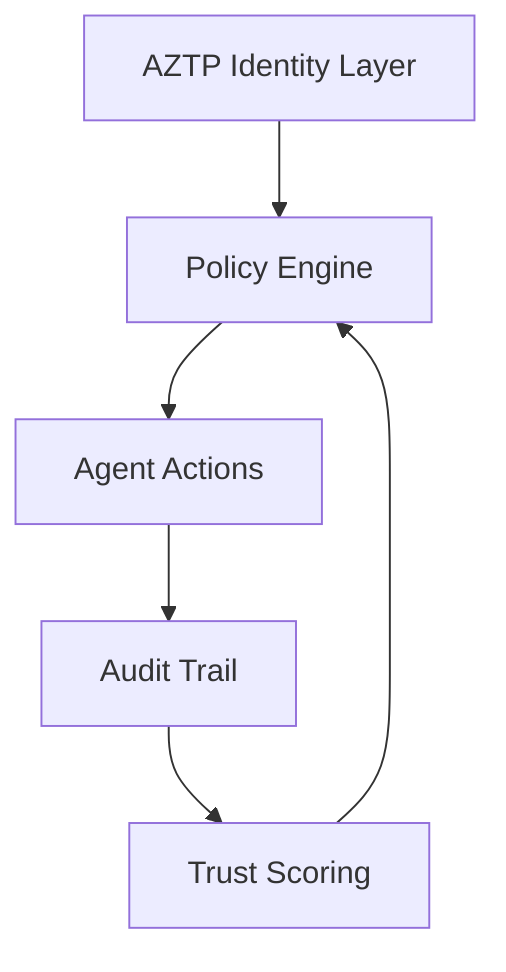
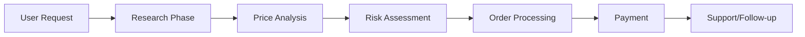

# 🛍️ ShopperAI: Secure Multi-Agent Shopping Platform

## Vision Statement

> "A secure, policy-driven shopping platform where intelligent agents collaborate under strict identity management to deliver a seamless shopping experience."

## 🎯 Core Value Proposition

ShopperAI transforms online shopping through a secure multi-agent system where each agent has:

- Clear identity and responsibilities
- Policy-driven access controls
- Real-time trust evaluation
- Auditable actions

## 🏗️ System Architecture

### Core Agents

1. **Research & Discovery**
   - ResearchAgent: Product search and analysis
   - PriceComparisonAgent: Deal optimization
2. **Transaction & Payment**

   - OrderAgent: Order management
   - PayPalAgent: Secure payments

3. **Customer Experience** (New)
   - CustomerSupportAgent: Support and refunds
   - PromotionsAgent: Personalized offers
   - RiskAgent: Transaction security

### Security Framework



## 🔐 Identity & Access Management

### Policy Structure

```json
{
  "Version": "2025-05-16",
  "Statement": {
    "Sid": "agent-policy",
    "Effect": "Allow",
    "Action": ["specific_actions"],
    "Condition": {
      "StringEquals": {
        "department": "Department",
        "trust_domain": "astha.ai"
      }
    }
  }
}
```

### Access Control Principles

1. **Zero Trust Architecture**

   - Every agent action requires verification
   - Dynamic trust scoring
   - Real-time policy enforcement

2. **Least Privilege**

   - Granular permissions
   - Context-based access
   - Time-bound authorizations

3. **Audit & Compliance**
   - Complete action logging
   - Policy violation alerts
   - Compliance reporting

## 💡 Key Features

### 1. Intelligent Shopping

- Advanced product research
- Price optimization
- Automated ordering
- Secure payment processing

### 2. Customer Support

- Automated refund processing
- FAQ management
- Ticket escalation
- Fraud prevention

### 3. Personalization

- Custom promotions
- Shopping history analysis
- Risk-based recommendations
- Dynamic pricing

## 🔄 Workflow Example



## 🎯 Target Use Cases

### 1. Consumer Shopping

- Product research
- Price comparison
- Secure checkout
- Post-purchase support

### 2. Enterprise Procurement

- Policy-compliant purchasing
- Bulk order management
- Vendor analysis
- Audit trails

### 3. Retail Integration

- Inventory management
- Price optimization
- Customer analytics
- Fraud prevention

## 📈 Growth Strategy

### 1. Platform Expansion

- Additional agent types
- More payment methods
- Enhanced AI capabilities
- Advanced analytics

### 2. Security Enhancements

- Biometric verification
- Blockchain integration
- Advanced encryption
- Compliance frameworks

### 3. Market Penetration

- API marketplace
- Enterprise solutions
- White-label options
- Global expansion

## 💰 Revenue Streams

1. **Transaction Fees**

   - Payment processing
   - Order management
   - Premium features

2. **Enterprise Solutions**

   - Custom policies
   - Dedicated agents
   - Advanced security
   - API access

3. **Support Services**
   - Priority support
   - Custom integration
   - Training
   - Consulting

## 🔒 Security & Compliance

### 1. Data Protection

- End-to-end encryption
- Secure storage
- Access controls
- Data minimization

### 2. Compliance

- GDPR compliance
- PCI DSS standards
- SOC 2 certification
- ISO 27001

### 3. Monitoring

- Real-time alerts
- Performance metrics
- Security incidents
- Usage patterns

## 🚀 Future Roadmap

### Phase 1: Foundation

- Core agent implementation
- Basic security features
- Essential workflows

### Phase 2: Enhancement

- Advanced agents
- Enhanced security
- API marketplace

### Phase 3: Scale

- Global expansion
- Enterprise features
- Advanced analytics

## 🎯 Success Metrics

1. **Security**

   - Policy compliance rate
   - Security incident rate
   - Trust score averages

2. **Performance**

   - Transaction success rate
   - Response times
   - User satisfaction

3. **Growth**
   - User adoption
   - Transaction volume
   - Revenue growth

## 🤝 Conclusion

ShopperAI represents a new paradigm in secure, automated shopping platforms where:

- Every action is policy-driven
- Every agent is accountable
- Every transaction is secure
- Every user is protected

This combination of security, automation, and user experience creates a unique value proposition in the e-commerce landscape.
