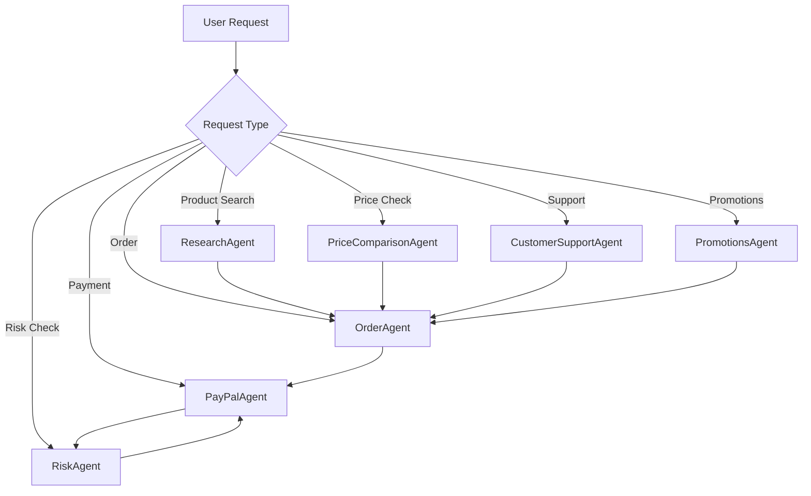

# ShopperAI Documentation

## Project Overview

ShopperAI is an intelligent shopping assistant that helps users find and analyze products based on their criteria. The system uses AI agents to perform product research, analysis, recommendations, and provides comprehensive customer support.

## Main Menu Options

1. **Search and Buy Products**

   - Search for products with specific criteria
   - Compare prices and features
   - Apply available promotions
   - Complete purchase with PayPal integration

2. **View Shopping History and Personalized Discounts**

   - View past transactions
   - Access personalized discount offers
   - See shopping patterns and insights
   - Track order history

3. **View Active Promotions**

   - Browse current promotional campaigns
   - Check campaign details and validity
   - View discount percentages and conditions
   - See minimum purchase requirements

4. **Customer Support**
   - Request refunds
   - Access FAQ help
   - Create support tickets
   - Track support requests

## Customer Support Options

### 1. Request Refund

Process:

- Enter transaction ID
- Provide refund reason
- Specify refund amount
- Receive refund confirmation with:
  - Refund ID
  - Transaction ID
  - Refund time
  - Status
  - Amount
  - Reason
  - Confirmation message

### 2. FAQ Help

Process:

- Submit your question
- Receive detailed response
- Access common troubleshooting steps
- Get links to relevant resources

### 3. Create Support Ticket

Process:

- Enter customer ID
- Select issue type (Technical/Billing/General)
- Choose priority level (Low/Medium/High)
- Provide detailed description
- Receive ticket confirmation with tracking number

## Product Search and Purchase Flow

1. **Initial Search**

   - Enter search query
   - Specify maximum price
   - Set minimum rating requirement (0-5)

2. **View Results**

   - See best match
   - Compare multiple products
   - View detailed specifications
   - Check prices and ratings

3. **Price Comparison**

   - Compare prices across products
   - View shipping costs
   - See total cost calculations
   - Check available discounts

4. **Promotions**

   - View available promotions:
     - Personal discounts
     - Campaign promotions
   - Select applicable promotion
   - See discount calculations:
     - Original price
     - Discount amount
     - Final price

5. **Payment Process**
   - Enter merchant/business PayPal email
   - Review order details
   - See promotion applications
   - Complete PayPal payment:
     1. Access PayPal URL
     2. Log in to sandbox account
     3. Approve payment
     4. Confirm transaction

## Architecture

### Core Components

1. **ResearchAgent**

   - Main agent responsible for product search and analysis
   - Inherits from CrewAI's Agent class
   - Uses specialized tools for product search and analysis
   - Located in `agents/research_agent.py`
   - Key capabilities:
     - Product search and filtering
     - Detailed product analysis
     - Rating-based recommendations
     - Price range filtering

2. **PriceComparisonAgent**

   - Specialized agent for price analysis and comparison
   - Inherits from CrewAI's Agent class
   - Features memory management for efficient comparisons
   - Located in `agents/price_comparison_agent.py`
   - Key capabilities:
     - Price extraction and normalization
     - Total cost calculation (including shipping)
     - Brand and color extraction
     - Savings calculation
     - Memory caching for faster comparisons
     - Enhanced price comparison results structure

3. **OrderAgent**

   - New agent for managing order processing
   - Located in `agents/order_agent.py`
   - Key capabilities:
     - Order creation and management
     - Order status tracking
     - Integration with payment processing
     - Order validation and verification

4. **PayPalAgent**

   - Specialized agent for handling PayPal transactions
   - Inherits from CrewAI's Agent class
   - Located in `agents/paypal_agent.py`
   - Key capabilities:
     - Payment order creation and processing
     - Invoice generation
     - Order tracking
     - Secure payment handling
     - Integration with PayPal's API
   - Features:
     - Sandbox mode for testing
     - Comprehensive error handling
     - Transaction logging
     - Secure credential management
     - Order status verification before capture
     - Improved user guidance for payment approval

5. **Search Tools**

   - `ProductSearchTool`: Interfaces with Google Serper API for product search
   - `ProductAnalyzerTool`: Analyzes and filters products based on criteria
   - Located in `tools/search_tools.py`

6. **Payment Tools**

   - `PaymentTool`: Handles payment processing and verification
   - Located in `tools/payment_tool.py`
   - Features:
     - Payment order creation
     - Payment capture
     - Order status verification
     - Transaction logging

### File Structure

```
shopping/
├── agents/
│   ├── research_agent.py         # Research agent implementation
│   ├── price_comparison_agent.py # Price comparison agent implementation
│   ├── paypal_agent.py           # PayPal payment agent implementation
│   ├── order_agent.py            # Order processing agent implementation
│   ├── tasks.py                  # Task definitions
│   └── tasks/                    # Additional task implementations
├── tools/
│   ├── search_tools.py          # Search and analysis tools
│   ├── payment_tool.py          # Payment processing tool implementation
│   └── __init__.py              # Tools package initialization
├── examples/
│   └── paypal_integration_example.py # Example of PayPal integration
├── docs/
│   └── DOCUMENTATION.md         # Project documentation
├── main.py                      # Main orchestration and CLI
├── requirements.txt             # Project dependencies
├── product.json                 # Product data storage
├── paymentdetail.json           # Payment details storage
└── .env                         # Environment variables
```

## Implementation Details

### ResearchAgent

The ResearchAgent class is the core component that handles product search and analysis:

```python
class ResearchAgent(Agent):
    def __init__(self):
        super().__init__(
            role='Research Agent',
            goal='Find and analyze products based on user criteria',
            backstory="""You are an expert product researcher...""",
            verbose=True
        )
        self._search_tool = ProductSearchTool()
        self._analyzer_tool = ProductAnalyzerTool()
```

Key methods:

- `search_and_analyze(query, criteria)`: Searches and analyzes products
- `get_best_match(query, criteria)`: Returns the best matching product
- `analyze_products(products, criteria)`: Performs detailed product analysis
- `get_product_details(product)`: Extracts formatted product details

### PriceComparisonAgent

The PriceComparisonAgent class handles price analysis and comparison:

```python
class PriceComparisonAgent(Agent):
    def __init__(self):
        super().__init__(
            role='Price Comparison Agent',
            goal='Find the cheapest product and provide clear price recommendations',
            backstory="""You are an expert price analyst...""",
            verbose=True
        )
        self._comparison_memory = {}
        self._best_deal_memory = {}
```

Key methods:

- `find_best_deal(products)`: Identifies the best deal from product list
- `recommend_best_product(products)`: Creates structured product recommendations with enhanced details including:
  - Product name
  - Brand
  - Price
  - Color
  - Total cost
  - Rating
  - Summary of recommendation
- `_calculate_total_cost(product)`: Computes total cost including shipping
- `_extract_price(price_str)`: Normalizes price strings to float values
- `_calculate_savings_vs_average(products)`: Computes savings compared to average

### OrderAgent

The OrderAgent class manages order processing:

```python
class OrderAgent(Agent):
    def __init__(self):
        super().__init__(
            role='Order Processing Agent',
            goal='Manage and process customer orders',
            backstory="""You are an expert order processing agent...""",
            verbose=True
        )
```

Key methods:

- `create_order(product_details, customer_info)`: Creates a new order
- `validate_order(order_details)`: Validates order information
- `track_order(order_id)`: Tracks order status
- `update_order_status(order_id, status)`: Updates order status

### PayPalAgent

The PayPalAgent class handles all PayPal-related transactions:

```python
class PayPalAgent(Agent):
    def __init__(self):
        # Initialize PayPal toolkit
        self.paypal_toolkit = PayPalToolkit(
            client_id=os.getenv("PAYPAL_CLIENT_ID"),
            secret=os.getenv("PAYPAL_SECRET"),
            configuration=Configuration(
                actions={
                    "orders": {
                        "create": True,
                        "get": True,
                        "capture": True,
                    },
                    "invoices": {
                        "create": True,
                        "get": True,
                        "send": True,
                    },
                    "subscriptions": {
                        "create": True,
                        "get": True,
                        "cancel": True,
                    }
                },
                context=Context(sandbox=True)  # Use sandbox for testing
            )
        )

        # Initialize the agent with PayPal tools
        super().__init__(
            role='PayPal Payment Agent',
            goal='Process payments and manage PayPal transactions securely',
            backstory="""You are an expert PayPal payment processing agent...""",
            tools=self.paypal_toolkit.get_tools(),
            verbose=True
        )
```

Key methods:

- `create_payment_order(amount, currency, description, payee_email)`: Creates a new PayPal order with payee email
- `capture_payment(order_id)`: Captures payment for an authorized order with status verification
- `get_order_details(order_id)`: Retrieves order information
- `create_invoice(customer_email, amount, items)`: Generates PayPal invoices
- `_log_payment_detail(data)`: Logs payment details to a JSON file for tracking

### Payment Processing Flow

The payment processing flow has been enhanced to include a complete order lifecycle:

1. **Order Creation**

   - User selects a product
   - Order details are captured
   - Order ID is generated
   - Payee email is included in the order
   - Promotions are applied if eligible

2. **Promotion Application**

   - System checks for available promotions:
     - Personal discounts based on shopping history
     - Active campaign promotions
   - User selects desired promotion
   - System verifies minimum purchase requirements
   - Applies discount to order total

3. **Payment Approval**

   - User is presented with PayPal approval URL
   - User approves the payment in PayPal interface
   - Order status changes to "APPROVED"
   - System verifies approval status

4. **Payment Processing**

   - System verifies order status before capture
   - Payment is captured only if order is approved
   - Transaction ID is generated
   - Order status is updated to "COMPLETED"

5. **Confirmation**
   - Payment status is verified
   - Order status is confirmed
   - Transaction details are provided
   - Payment details are logged
   - Promotion details are recorded

Example payment confirmation with promotion:

```
Payment Capture Confirmation:
- Order ID: 9876543210
- Product Name: [Product Name]
- Original Price: $100.00
- Applied Promotion: Personal Discount (15% off)
- Discount Amount: $15.00
- Final Price: $85.00
- Transaction ID: 1234567890
- Payment Status: Processed
- Order Status: Confirmed
```

### Recent Updates

#### Enhanced Payment Processing

The system now includes a complete payment processing flow with improved error handling:

```python
def process_order_with_payment(product_details: dict, customer_email: str):
    # Initialize agents
    order_agent = OrderAgent()
    paypal_agent = PayPalAgent()

    # Create order task
    order_task = Task(
        description="Process the order...",
        agent=order_agent,
        expected_output="Order details including transaction ID and status"
    )

    # Create payment order task
    payment_order_task = Task(
        description="Create PayPal payment order...",
        agent=paypal_agent,
        expected_output="PayPal order details with order ID"
    )

    # Capture payment task
    capture_payment_task = Task(
        description="Capture the payment...",
        agent=paypal_agent,
        expected_output="Payment capture confirmation with transaction details"
    )

    # Create and run the crew
    crew = Crew(
        agents=[order_agent, paypal_agent],
        tasks=[order_task, payment_order_task, capture_payment_task],
        verbose=True
    )

    result = crew.kickoff()

    # Directly call PayPalAgent methods to ensure paymentdetail.json is updated
    order_data = paypal_agent.create_payment_order(
        amount=product_details['price'],
        currency="USD",
        description=product_details.get('description', ''),
        payee_email=customer_email
    )

    # Get the approval URL
    approval_url = order_data.get('approval_url')
    if approval_url:
        print(f"\nPlease complete your payment at the following PayPal URL:\n{approval_url}")
        print("\nInstructions:")
        print("1. Open the above URL in your browser.")
        print("2. Log in with your PayPal sandbox buyer account.")
        print("3. Approve the payment to complete your order.")
        print("\nAfter approval, the payment will be captured automatically.")

        # Ask if user wants to proceed with capture now or later
        capture_now = input("\nDo you want to capture the payment now? (y/n): ").lower()
        if capture_now == 'y':
            if order_data.get('paypal_order_id'):
                capture_data = paypal_agent.capture_payment(
                    order_data['paypal_order_id'])

                # Check if there was an error with the capture
                if isinstance(capture_data, dict) and "error" in capture_data:
                    print("\nPayment capture failed. The order may need to be approved first.")
                    print(f"Error: {capture_data.get('error')}")
                    print(f"Status: {capture_data.get('status')}")
                else:
                    print("\nPayment captured successfully!")
        else:
            print("\nPayment will need to be captured after approval.")
    else:
        print("\nNo approval URL found. Cannot proceed with payment.")

    return result
```

#### Order Status Verification

The system now includes order status verification before attempting to capture payments:

```python
def capture_payment(self, access_token, order_id):
    # First check the order status
    order_details = self.get_order_status(access_token, order_id)
    status = order_details.get('status')

    if status != 'APPROVED':
        print(f"[PayPalPaymentTool] Cannot capture payment: Order status is {status}, not APPROVED")
        print(f"[PayPalPaymentTool] Please approve the order first using the approval URL")
        return {"error": f"Order status is {status}, not APPROVED", "status": status}

    # Proceed with capture if order is approved
    url = f"https://api-m.sandbox.paypal.com/v2/checkout/orders/{order_id}/capture"
    headers = {
        "Authorization": f"Bearer {access_token}",
        "Content-Type": "application/json"
    }
    response = requests.post(url, headers=headers)
    response.raise_for_status()
    capture_response = response.json()
    print(f"[PayPalPaymentTool] Capture payment response: {capture_response}")
    return capture_response
```

#### Improved Error Handling

The PayPalAgent now includes enhanced error handling for payment capture:

```python
def capture_payment(self, order_id):
    access_token = self.payment_tool.get_access_token()
    capture_response = self.payment_tool.capture_payment(
        access_token, order_id)

    # Check if there was an error with the capture
    if isinstance(capture_response, dict) and "error" in capture_response:
        error_message = capture_response.get("error", "Unknown error")
        status = capture_response.get("status", "Unknown")

        # Get the approval URL from paymentdetail.json
        approval_url = None
        try:
            with open('shopping/paymentdetail.json', 'r') as f:
                payment_details = json.load(f)
                for detail in payment_details:
                    if detail.get('paypal_order_id') == order_id:
                        approval_url = detail.get('approval_url')
                        break
        except Exception as e:
            print(f"Error reading payment details: {str(e)}")

        result = {
            'error': error_message,
            'status': status,
            'paypal_order_id': order_id
        }

        if approval_url:
            result['approval_url'] = approval_url
            print(f"\nOrder needs to be approved first. Please use this URL to approve the payment:")
            print(f"{approval_url}")
            print("\nAfter approval, try capturing the payment again.")

        self._log_payment_detail({'action': 'capture_payment_error', **result})
        return result

    result = {
        'capture_result': capture_response,
        'paypal_order_id': order_id
    }
    self._log_payment_detail({'action': 'capture_payment', **result})
    return result
```

#### Price Comparison Results Structure

The price comparison results now follow a standardized structure:

```python
{
    "product": {
        "name": "Product Name",
        "brand": "Brand Name",
        "price": "Price",
        "color": "Color",
        "total_cost": "Total Cost",
        "rating": "Rating"
    },
    "summary": "Detailed recommendation summary"
}
```

#### Enhanced Error Handling

- Improved validation of product data
- Better handling of missing or invalid fields
- Clear error messages for various scenarios
- Fallback to sample data when needed
- Order status verification before payment capture
- User-friendly guidance for payment approval

#### Display Improvements

The main application now displays price comparison results in a more user-friendly format:

```
Price Comparison Results:
Best Deal:
Product: [Product Name]
Price: [Price]
Brand: [Brand Name]
Rating: [Rating]
Summary: [Detailed recommendation]
```

#### Enhanced File Management

The system now includes improved file handling and data persistence:

1. **Absolute Path Handling**

   - All file paths are resolved to absolute paths
   - Consistent path handling across different operating systems
   - Proper directory creation if not exists

2. **Data Persistence**

   - Products are saved in a structured JSON format
   - Payment details are logged to paymentdetail.json
   - Data can be loaded and reused between sessions
   - Automatic file creation if not exists
   - Backup mechanisms for data integrity

3. **Error Handling**
   - Comprehensive error catching and logging
   - User-friendly error messages
   - Graceful fallbacks for missing files
   - Debug information for troubleshooting

### Search Tools

#### ProductSearchTool

```python
class ProductSearchTool:
    def run(self, query: str) -> List[Dict[str, Any]]:
        # Searches products using Google Serper API
        # Returns list of product dictionaries
```

#### ProductAnalyzerTool

```python
class ProductAnalyzerTool:
    def run(self, products: List[Dict[str, Any]], criteria: Dict[str, Any]) -> List[Dict[str, Any]]:
        # Analyzes products based on criteria
        # Returns filtered and analyzed products
```

### Task System

Tasks are defined in `agents/tasks.py`:

```python
class ResearchTasks:
    def create_search_task(self, agent, query, criteria):
        return Task(
            description=f"Search for products matching: {query}",
            agent=agent,
            expected_output="A list of products matching the search criteria"
        )
```

## Memory Management

### Research Agent Memory

- Caches search results for faster repeated queries
- Stores analyzed product data
- Uses memory keys based on search criteria
- Improves performance for identical searches

### Price Comparison Agent Memory

- Maintains two types of memory:
  - `_comparison_memory`: Complete recommendations
  - `_best_deal_memory`: Best deal calculations
- Memory keys based on product details
- Benefits:
  - Faster repeated comparisons
  - Consistent results
  - Resource optimization
  - Reduced API calls

## Setup and Configuration

### Environment Variables

Create a `.env` file with:

```
SERPAPI_API_KEY=your_api_key_here
AZTP_API_KEY=your_api_key_here
PAYPAL_CLIENT_ID=your_paypal_client_id
PAYPAL_SECRET=your_paypal_secret
PAYPAL_MERCHANT_EMAIL=your_merchant_email
```

### Dependencies

Install required packages:

```bash
pip install -r requirements.txt
```

Current dependencies:

- crewai>=0.11.0
- python-dotenv>=0.19.0
- requests>=2.26.0
- google-search-results>=2.4.2
- langchain>=0.1.0
- aztp>=0.1.0
- termcolor>=1.1.0
- paypal-agent-toolkit>=1.3.0

## Usage

### Running the Application

```bash
python main.py
```

The application will:

1. Prompt for search query
2. Ask for maximum budget
3. Request minimum rating requirement
4. Search for products
5. Analyze results
6. Display recommendations
7. Offer price comparison (optional)
8. Process payment via PayPal (if selected)

### Example Interaction

```
## Welcome to ShopperAI
------------------------

What would you like to search for?
laptop

What is your maximum budget?
800

What is your minimum required rating (0-5)?
4.0

Would you like to compare prices? (y/n)
y

Would you like to proceed with payment? (y/n)
y

Please enter your email for payment:
customer@example.com

Please complete your payment at the following PayPal URL:
https://www.sandbox.paypal.com/checkoutnow?token=XXXXX

Instructions:
1. Open the above URL in your browser.
2. Log in with your PayPal sandbox buyer account.
3. Approve the payment to complete your order.

After approval, the payment will be captured automatically.

Do you want to capture the payment now? (y/n):
y
```

### PayPal Integration Example

```python
from agents.order_agent import OrderAgent
from agents.paypal_agent import PayPalAgent
from crewai import Crew, Task

# Example usage
product = {
    "name": "Premium Widget",
    "price": "99.99",
    "quantity": 1,
    "description": "High-quality premium widget"
}

customer_email = "customer@example.com"

try:
    result = process_order_with_payment(product, customer_email)
    print("Order processed successfully:", result)
except Exception as e:
    print(f"Error processing order: {str(e)}")
```

## Future Enhancements

1. Add more specialized agents for:
   - Review analysis
   - Deal hunting
   - Payment processing (additional payment methods)
2. Implement product tracking
3. Add support for multiple retailers
4. Enhance product recommendations with ML
5. Add persistent storage for memory
6. Implement memory expiration
7. Add memory size limits
8. Expand PayPal features:
   - Subscription management
   - Refund processing
   - Dispute handling
   - Automatic payment capture after approval
   - Webhook integration for payment status updates

## Troubleshooting

### Common Issues

1. **API Key Issues**

   - Ensure SERPAPI_API_KEY is set in .env
   - Verify API key is valid and has sufficient credits
   - Check PayPal credentials are correctly configured

2. **Search Results**

   - No results found: Try broadening search criteria
   - Too many results: Add more specific criteria

3. **Memory Management**

   - Memory cleared on restart: Consider implementing persistent storage
   - High memory usage: Implement memory size limits

4. **PayPal Integration**
   - Sandbox mode: Ensure you're using test credentials
   - Payment failures: Check error logs for details
   - API rate limits: Implement retry logic
   - Payment capture issues: Verify order status before capture
   - Transaction verification: Check PayPal sandbox dashboard
   - 422 Unprocessable Entity error: Ensure order is approved before capture
   - Missing payee email: Verify payee email is included in order creation

### Error Messages

- "Unable to generate pydantic-core schema": Check agent implementation
- "API request failed": Verify API key and internet connection
- "Memory key generation failed": Check product data format
- "PayPal API error": Check credentials and API status
- "Payment capture failed": Verify order status and amount
- "Transaction verification failed": Check PayPal sandbox logs
- "Order status is CREATED, not APPROVED": Order needs to be approved before capture
- "422 Client Error: Unprocessable Entity": Order is not in the correct state for capture

## Contributing

1. Fork the repository
2. Create a feature branch
3. Make your changes
4. Submit a pull request

## License

This project is licensed under the MIT License.

### Environment Setup and Script Execution

The system now includes improved environment setup and script execution:

1. **Virtual Environment Management**

   - Uses `.venv` directory for virtual environment
   - Automatic environment activation
   - Dependency management through `requirements.txt`
   - Environment variable handling

2. **Script Execution**

   ```bash
   # Activate virtual environment and run script
   source .venv/bin/activate && python main.py
   ```

3. **Environment Variables**
   - Secure handling of API keys
   - Configuration through `.env` file
   - Environment-specific settings
   - Sensitive data protection

### Recent Updates

#### Script Execution Improvements

The system now includes enhanced script execution capabilities:

1. **Virtual Environment**

   - Consistent virtual environment location
   - Automatic activation and deactivation
   - Isolated dependency management
   - Cross-platform compatibility

2. **Error Handling**

   - Graceful handling of environment activation failures
   - Clear error messages for missing dependencies
   - Fallback mechanisms for environment issues
   - Debug information for troubleshooting

3. **Configuration Management**
   - Centralized configuration through environment variables
   - Secure handling of sensitive data
   - Environment-specific settings
   - Easy configuration updates

### Product Search and Analysis

The system now includes enhanced product search and analysis capabilities:

1. **Search Functionality**

   - Advanced product filtering
   - Price range constraints
   - Rating-based filtering
   - Multiple retailer support

2. **Product Analysis**

   ```python
   def analyze_products(products, max_price, min_rating):
       """Analyze products based on criteria"""
       filtered_products = [
           p for p in products
           if p['price'] <= max_price and p['rating'] >= min_rating
       ]
       return sorted(filtered_products, key=lambda x: x['rating'], reverse=True)
   ```

3. **Result Processing**
   - Structured JSON output
   - Caching of search results
   - Efficient data retrieval
   - Result validation

#### Search and Analysis Improvements

The system now includes enhanced product search and analysis features:

1. **Search Optimization**

   - Improved search algorithms
   - Better price comparison
   - Enhanced rating system
   - Faster result retrieval

2. **Data Processing**

   - Efficient data filtering
   - Smart sorting algorithms
   - Result caching
   - Memory optimization

3. **User Experience**
   - Clear search results
   - Detailed product information
   - Easy price comparison
   - Rating visualization

## Promotions System

### Types of Promotions

1. **Personal Discounts**

   - Based on shopping history
   - Customized discount percentages
   - Minimum purchase requirements
   - Limited time validity
   - Example structure:
     ```json
     {
       "type": "personal",
       "name": "Personal Discount",
       "discount_percentage": 15,
       "minimum_purchase": 100,
       "valid_until": "2024-12-31T23:59:59Z"
     }
     ```

2. **Campaign Promotions**
   - Store-wide or category-specific
   - Fixed discount percentages
   - Campaign duration
   - Specific conditions
   - Example structure:
     ```json
     {
       "type": "campaign",
       "name": "Summer Sale",
       "discount_percentage": 20,
       "minimum_purchase": 50,
       "valid_until": "2024-08-31T23:59:59Z",
       "conditions": {
         "categories": ["summer", "outdoor"]
       }
     }
     ```

### Promotion Application Process

1. **Availability Check**

   - System checks for personal discounts
   - Retrieves active campaigns
   - Validates promotion dates
   - Verifies eligibility

2. **Selection**

   - Display available promotions
   - Show discount details
   - Present minimum requirements
   - Allow user selection

3. **Validation**

   - Verify minimum purchase
   - Check category restrictions
   - Validate promotion dates
   - Confirm eligibility

4. **Application**
   - Calculate original price
   - Apply discount percentage
   - Calculate final price
   - Update order details

## Customer Support System

### Refund Processing

1. **Request Initiation**

   ```python
   refund_details = {
       "transaction_id": "1234567890",
       "reason": "Product not as described",
       "amount": 99.99
   }
   ```

2. **Validation**

   - Verify transaction exists
   - Check refund amount
   - Validate reason
   - Confirm eligibility

3. **Processing**

   - Generate refund ID
   - Record timestamp
   - Process refund
   - Update transaction status

4. **Confirmation**
   ```python
   confirmation = {
       "refund_id": "REF-12345678",
       "transaction_id": "1234567890",
       "refund_time": "2024-03-20 15:30:45",
       "status": "Processed",
       "amount": 99.99,
       "reason": "Product not as described",
       "message": "Your refund has been successfully processed."
   }
   ```

### FAQ System

1. **Query Processing**

   - Natural language processing
   - Keyword extraction
   - Category matching
   - Response generation

2. **Response Structure**
   ```python
   faq_response = {
       "query": "How do I track my order?",
       "answer": "Detailed answer...",
       "related_topics": ["order status", "shipping"],
       "helpful_links": ["tracking guide", "contact support"]
   }
   ```

### Support Ticket System

1. **Ticket Creation**

   ```python
   ticket_details = {
       "customer_id": "CUST123",
       "issue_type": "Technical",
       "priority": "High",
       "description": "Detailed issue description"
   }
   ```

2. **Ticket Processing**

   - Generate unique ticket ID
   - Assign priority
   - Route to appropriate team
   - Set initial status

3. **Confirmation**
   ```python
   ticket_confirmation = {
       "ticket_id": "TICKET-12345678-202403201530",
       "status": "Created",
       "estimated_response": "24 hours",
       "priority_level": "High"
   }
   ```

## Error Handling

### Payment Errors

1. **Capture Failures**

   ```python
   {
       "error": "Order not approved",
       "status": "CREATED",
       "message": "Order needs to be approved before capture"
   }
   ```

2. **Validation Errors**
   ```python
   {
       "error": "Invalid amount",
       "field": "price",
       "message": "Amount must be greater than 0"
   }
   ```

### Promotion Errors

1. **Eligibility Errors**

   ```python
   {
       "error": "Minimum purchase not met",
       "required": 100.00,
       "current": 75.00
   }
   ```

2. **Validation Errors**
   ```python
   {
       "error": "Expired promotion",
       "valid_until": "2024-03-19T23:59:59Z",
       "current_time": "2024-03-20T12:00:00Z"
   }
   ```

### Support System Errors

1. **Refund Errors**

   ```python
   {
       "error": "Invalid transaction",
       "transaction_id": "1234567890",
       "message": "Transaction not found"
   }
   ```

2. **Ticket Creation Errors**
   ```python
   {
       "error": "Invalid priority",
       "allowed_values": ["Low", "Medium", "High"],
       "received": "Critical"
   }
   ```

## Data Storage

### Payment Details

File: `paymentdetail.json`

```json
{
  "action": "capture_payment",
  "capture_result": {
    "id": "1234567890",
    "status": "COMPLETED",
    "amount": {
      "currency_code": "USD",
      "value": "99.99"
    },
    "payer": {
      "email_address": "customer@example.com"
    }
  }
}
```

### Product Details

File: `product.json`

```json
{
  "raw_products": [...],
  "filtered_products": [...],
  "top_products": [...],
  "best_match": {
    "name": "Product Name",
    "price": "99.99",
    "rating": "4.5",
    "description": "Product description"
  }
}
```

## Agent System

### Core Agents

1. **ResearchAgent**

   - Role: Product research and analysis
   - Responsibilities:
     - Product search and filtering
     - Detailed product analysis
     - Rating-based recommendations
     - Price range filtering
   - Key Methods:
     - `search_and_analyze(query, criteria)`
     - `get_best_match(query, criteria)`
     - `analyze_products(products, criteria)`

2. **PriceComparisonAgent**

   - Role: Price analysis and comparison
   - Responsibilities:
     - Price extraction and normalization
     - Total cost calculation
     - Brand and color extraction
     - Savings calculation
   - Key Methods:
     - `find_best_deal(products)`
     - `recommend_best_product(products)`
     - `_calculate_total_cost(product)`

3. **OrderAgent**

   - Role: Order processing and management
   - Responsibilities:
     - Order creation and management
     - Order status tracking
     - Order validation
     - Status updates
   - Key Methods:
     - `create_order(product_details, customer_info)`
     - `validate_order(order_details)`
     - `track_order(order_id)`

4. **PayPalAgent**
   - Role: Payment processing
   - Responsibilities:
     - Payment order creation
     - Payment capture
     - Invoice generation
     - Transaction logging
   - Key Methods:
     - `create_payment_order(amount, currency, description, payee_email)`
     - `capture_payment(order_id)`
     - `get_order_details(order_id)`

### Support Agents

5. **CustomerSupportAgent**

   - Role: Customer support operations
   - Responsibilities:
     - Refund processing
     - FAQ response handling
     - Support ticket management
     - Issue escalation
   - Key Methods:
     - `process_refund(order_details)`
     - `get_faq_response(query)`
     - `create_support_ticket(issue_details)`
   - Access Level:
     ```json
     {
       "Version": "2025-05-16",
       "Statement": {
         "Sid": "customer-support-policy",
         "Effect": "Allow",
         "Action": ["process_refund", "read_faq", "create_ticket"],
         "Condition": {
           "StringEquals": {
             "department": "CustomerSupport",
             "trust_domain": "astha.ai"
           },
           "NumberLessThan": {
             "refund_amount": 500
           }
         }
       }
     }
     ```

6. **PromotionsAgent**

   - Role: Promotional activities management
   - Responsibilities:
     - Personal discount creation
     - Campaign management
     - Shopping history analysis
     - Promotion validation
   - Key Methods:
     - `create_personalized_discount(user_id, history)`
     - `create_promotion_campaign(campaign_data)`
     - `analyze_shopping_history(user_id, history)`
   - Access Level:
     ```json
     {
       "Version": "2025-05-16",
       "Statement": {
         "Sid": "promotions-agent-policy",
         "Effect": "Allow",
         "Action": ["read_history", "create_promotion", "update_campaign"],
         "Condition": {
           "StringEquals": {
             "department": "Marketing",
             "trust_domain": "astha.ai"
           },
           "BoolEquals": {
             "pii_access": false
           }
         }
       }
     }
     ```

7. **RiskAgent**
   - Role: Transaction risk monitoring
   - Responsibilities:
     - Transaction pattern analysis
     - Suspicious activity detection
     - High-risk order flagging
     - Risk assessment
   - Key Methods:
     - `analyze_transaction(transaction_data)`
     - `flag_suspicious_activity(order_id)`
     - `get_risk_score(transaction_data)`
   - Access Level:
     ```json
     {
       "Version": "2025-05-16",
       "Statement": {
         "Sid": "risk-agent-policy",
         "Effect": "Allow",
         "Action": ["analyze_transaction", "flag_suspicious", "read_patterns"],
         "Condition": {
           "StringEquals": {
             "department": "Risk",
             "trust_domain": "astha.ai"
           },
           "BoolEquals": {
             "full_pii_access": false
           }
         }
       }
     }
     ```

### Agent Interaction Flow



### Agent Communication

1. **Event-Based**

   - Agents subscribe to relevant events
   - Asynchronous communication
   - Event queuing and processing
   - Status updates

2. **Task-Based**

   - Clear task definitions
   - Expected outputs
   - Task dependencies
   - Error handling

3. **Data Sharing**
   - Shared memory management
   - Data persistence
   - Access control
   - Data validation

## User Guide

### Getting Started

1. **Installation**

   ```bash
   # Clone the repository
   git clone https://github.com/your-repo/ShopperAI.git

   # Navigate to project directory
   cd ShopperAI

   # Install dependencies
   pip install -r requirements.txt

   # Set up environment variables
   cp .env.example .env
   # Edit .env with your API keys and credentials
   ```

2. **Configuration**
   Required environment variables:
   ```
   SERPAPI_API_KEY=your_api_key_here
   AZTP_API_KEY=your_api_key_here
   PAYPAL_CLIENT_ID=your_paypal_client_id
   PAYPAL_SECRET=your_paypal_secret
   PAYPAL_MERCHANT_EMAIL=your_merchant_email
   ```

### Using the Application

1. **Starting the Application**

   ```bash
   python main.py
   ```

   You will see the main menu with options:

   ```
   Welcome to ShopperAI!
   Available actions:
   1. Search and buy products
   2. View your shopping history and personalized discounts
   3. View active promotions
   4. Customer Support
   5. Exit
   ```

2. **Searching for Products**

   ```
   Select option: 1

   What would you like to search for? laptop
   Maximum price (in USD): 800
   Minimum rating (0-5): 4.0

   Searching for products...
   [Results will be displayed here]
   ```

3. **Using Price Comparison**

   ```
   Would you like to compare prices for these products? (y/n): y

   Price Comparison Results:
   Best Deal:
   Product: [Product Name]
   Price: $799.99
   Rating: 4.5
   ```

4. **Applying Promotions**

   ```
   [Available Promotions]
   1. Personal Discount
      Discount: 15%
      Minimum Purchase: $100
      Valid Until: 2024-12-31

   2. Summer Sale
      Discount: 20%
      Minimum Purchase: $50
      Valid Until: 2024-08-31

   Select a promotion number (or 0 to skip): 1
   ```

5. **Making a Purchase**

   ```
   Would you like to proceed with payment? (y/n): y

   Please enter the merchant/business PayPal email address: merchant@example.com

   [PayPal Order Created]
   Original Price: $799.99
   Applied Promotion: Personal Discount (15% off)
   Final Price: $679.99

   Please complete your payment at the following PayPal URL:
   https://www.sandbox.paypal.com/checkoutnow?token=XXXXX

   Instructions:
   1. Open the above URL in your browser
   2. Log in with your PayPal sandbox buyer account
   3. Approve the payment to complete your order
   ```

### Customer Support Guide

1. **Accessing Support**

   ```
   Select option: 4

   Customer Support Options:
   1. Request Refund
   2. FAQ Help
   3. Create Support Ticket
   4. Back to Main Menu
   ```

2. **Requesting a Refund**

   ```
   Select option: 1

   Enter transaction ID: 1234567890
   Enter refund reason: Product not as described
   Enter refund amount: 99.99

   [Refund Request Result]
   {
     "refund_id": "REF-12345678",
     "status": "Processed",
     "message": "Your refund has been successfully processed."
   }
   ```

3. **Getting FAQ Help**

   ```
   Select option: 2

   What's your question? How do I track my order?

   [FAQ Response]
   {
     "answer": "Detailed tracking instructions...",
     "helpful_links": ["tracking guide", "contact support"]
   }
   ```

4. **Creating Support Ticket**

   ```
   Select option: 3

   Enter your customer ID: CUST123
   Enter issue type (Technical/Billing/General): Technical
   Enter priority (Low/Medium/High): High
   Enter issue description: Detailed problem description

   [Support Ticket Created]
   {
     "ticket_id": "TICKET-12345678-202403201530",
     "status": "Created",
     "estimated_response": "24 hours"
   }
   ```

### Shopping History and Promotions

1. **Viewing Shopping History**

   ```
   Select option: 2

   Please enter your email address: customer@example.com

   [Shopping History Analysis]
   {
     "total_transactions": 5,
     "total_spent": 1234.56,
     "average_order": 246.91,
     "favorite_categories": ["electronics", "books"]
   }
   ```

2. **Checking Active Promotions**

   ```
   Select option: 3

   [Active Promotion Campaigns]
   {
     "name": "Summer Sale",
     "description": "Special discounts on summer items",
     "discount_value": 15,
     "minimum_purchase": 100
   }
   ```

### Common Use Cases

1. **Finding Best Deals**

   ```
   1. Start the application
   2. Choose option 1 (Search and buy products)
   3. Enter search criteria
   4. Select 'y' for price comparison
   5. Review best deals
   ```

2. **Getting Support**

   ```
   1. Start the application
   2. Choose option 4 (Customer Support)
   3. Select appropriate support option
   4. Follow the prompts
   ```

3. **Using Promotions**
   ```
   1. Search for products
   2. Proceed to payment
   3. Review available promotions
   4. Select desired promotion
   5. Complete purchase with discount
   ```

### Troubleshooting

1. **Payment Issues**

   - Verify PayPal sandbox credentials
   - Check minimum purchase requirements
   - Ensure order approval before capture
   - Verify merchant email address

2. **Search Problems**

   - Check API key configuration
   - Verify search criteria
   - Try broader search terms
   - Check internet connection

3. **Promotion Errors**

   - Verify promotion validity
   - Check minimum purchase requirements
   - Ensure promotion hasn't expired
   - Verify category restrictions

4. **Support Issues**
   - Double-check transaction IDs
   - Verify customer ID format
   - Ensure proper issue categorization
   - Provide detailed descriptions

### Best Practices

1. **Searching Products**

   - Use specific search terms
   - Set realistic price ranges
   - Consider minimum ratings
   - Compare multiple products

2. **Using Promotions**

   - Check all available promotions
   - Compare discount values
   - Verify requirements
   - Calculate final prices

3. **Payment Process**

   - Double-check amounts
   - Verify merchant details
   - Follow PayPal instructions
   - Keep transaction IDs

4. **Support Requests**
   - Provide clear descriptions
   - Include relevant details
   - Keep reference numbers
   - Follow up when needed
