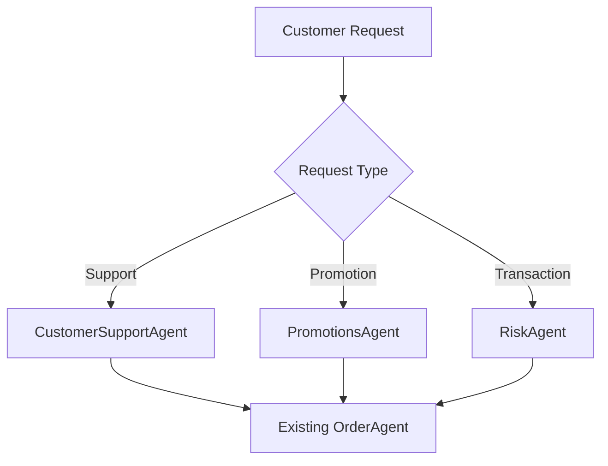

# ShopperAI New Features Implementation Plan

## Overview

This document outlines the plan for implementing new features in the ShopperAI system while maintaining existing functionality. The implementation focuses on adding new AI agents with specific responsibilities and implementing a robust IAM (Identity Access Management) system.

## Current System Architecture

### Existing Components

- **Main Orchestrator**: ShopperAI (main.py)
- **Agents**:
  - ResearchAgent: Product research and analysis
  - PriceComparisonAgent: Price comparison and recommendations
  - OrderAgent: Order processing
  - PayPalAgent: Payment processing
- **Tools**:
  - Search tools
  - Payment tools

## New Features Implementation

### 1. New AI Agents

#### CustomerSupportAgent

- **Purpose**: Handle customer support operations
- **Responsibilities**:
  - Process refund requests
  - Manage FAQ responses
  - Handle support ticket escalations
- **Access Level**:
  ```json
  {
    "Version": "2025-05-16",
    "Statement": {
      "Sid": "customer-support-policy",
      "Effect": "Allow",
      "Action": ["process_refund", "read_faq", "create_ticket"],
      "Condition": {
        "StringEquals": {
          "department": "CustomerSupport",
          "trust_domain": "astha.ai"
        },
        "NumberLessThan": {
          "refund_amount": 500
        }
      }
    }
  }
  ```

#### PromotionsAgent

- **Purpose**: Manage promotional activities
- **Responsibilities**:
  - Create personalized discounts
  - Manage promotion campaigns
  - Analyze shopping history
- **Access Level**:
  ```json
  {
    "Version": "2025-05-16",
    "Statement": {
      "Sid": "promotions-agent-policy",
      "Effect": "Allow",
      "Action": ["read_history", "create_promotion", "update_campaign"],
      "Condition": {
        "StringEquals": {
          "department": "Marketing",
          "trust_domain": "astha.ai"
        },
        "BoolEquals": {
          "pii_access": false
        }
      }
    }
  }
  ```

#### RiskAgent

- **Purpose**: Monitor and analyze transaction risks
- **Responsibilities**:
  - Analyze transaction patterns
  - Detect suspicious activities
  - Flag high-risk orders
- **Access Level**:
  ```json
  {
    "Version": "2025-05-16",
    "Statement": {
      "Sid": "risk-agent-policy",
      "Effect": "Allow",
      "Action": ["analyze_transaction", "flag_suspicious", "read_patterns"],
      "Condition": {
        "StringEquals": {
          "department": "Risk",
          "trust_domain": "astha.ai"
        },
        "BoolEquals": {
          "full_pii_access": false
        }
      }
    }
  }
  ```

#### MaliciousAgent

- **Purpose**: Simulate an agent without a valid identity for security testing
- **Responsibilities**:
  - Attempt unauthorized access to other agents (e.g., PayPalAgent)
  - Test IAM rejection mechanisms
- **Access Level**:
  ```json
  {
    "Version": "2025-05-16",
    "Statement": {
      "Sid": "fake-agent-policy",
      "Effect": "Deny",
      "Action": ["*"],
      "Condition": {
        "Null": { "identity": true }
      }
    }
  }
  ```

#### MarketAgent

- **Purpose**: Represent an agent from a different trust domain
- **Responsibilities**:
  - Attempt cross-domain interactions (e.g., with PayPalAgent)
  - Test policy enforcement for trust domains
- **Access Level**:
  ```json
  {
    "Version": "2025-05-16",
    "Statement": {
      "Sid": "market-agent-policy",
      "Effect": "Allow",
      "Action": ["market_operations"],
      "Condition": {
        "StringEquals": {
          "trust_domain": "marketplace.com"
        }
      }
    }
  }
  ```

### 2. IAM Implementation

#### Access Control System

- **Policy Management**:
  - AZTP-based identity verification
  - Role-based access control
  - Dynamic trust scoring
  - Real-time access monitoring

#### Integration with AZTP Client

```python
# Example Implementation
async def verify_agent_access(agent_id: str, action: str, policy_code: str) -> bool:
    identity_access_policy = await aztpClient.get_policy(agent_id)
    policy = aztpClient.get_policy_value(
        identity_access_policy,
        "code",
        policy_code
    )
    return aztpClient.is_action_allowed(policy, action)
```

### 3. Implementation Phases

#### Phase 1: Agent Implementation (Week 1-2)

- Create new agent classes
- Implement basic functionality
- Set up agent-specific tools
- Unit testing

#### Phase 2: IAM Integration (Week 3-4)

- Implement AZTP policies
- Set up access control
- Configure trust scoring
- Integration testing

#### Phase 3: Feature Integration (Week 5-6)

- Connect to existing workflow
- End-to-end testing
- Performance optimization
- Documentation updates

## Integration with Existing System

### Code Structure

```python
class ShopperAgents:
    # Existing agents remain unchanged
    def research_agent(self):
        return ResearchAgent()

    def price_comparison_agent(self):
        return PriceComparisonAgent()

    def order_agent(self):
        return OrderAgent()

    def paypal_agent(self):
        return PayPalAgent()

    # New agent implementations
    def customer_support_agent(self):
        return CustomerSupportAgent()

    def promotions_agent(self):
        return PromotionsAgent()

    def risk_agent(self):
        return RiskAgent()
```

### Workflow Integration



## PayPalAgent Secure Communication Method

PayPalAgent exposes a communication method that accepts an aztp_id and data from another agent.

**Process:**

1. **Policy & Trust Domain Check:**
   - The method checks:
     • Whether the aztp_id is present (valid identity).
     • Whether the requested action is allowed for the agent (using is_action_allowed).
     • Whether the agent's trustDomain matches the policy requirements.
   - If the aztp_id is missing, it returns an "Unauthorized access" error.
   - If the aztp_id is present but fails policy or trust domain checks, it returns an error message indicating a policy violation.
   - If all checks pass, it prints "Connection successful."
2. **Error Handling:**
   - Any unsuccessful policy or trust domain check results in a clear error message ("Policy violation").
   - Only missing aztp_id results in "Unauthorized access."

**Example Scenarios:**

- If MaliciousAgent (no identity) tries to connect, the method returns "Unauthorized access."
- If MarketAgent (wrong trust domain) tries to connect, the method returns "Policy violation."
- If a valid agent with correct trust domain and permissions connects, the method prints "Connection successful."

## Security Considerations

### Access Control

- Granular permissions based on agent roles
- Dynamic trust scoring
- Real-time access monitoring
- Audit trail generation

### Data Protection

- Limited PII access
- Encrypted data transmission
- Secure storage practices
- Access logging

## Testing Strategy

### Unit Testing

- Individual agent functionality
- Policy enforcement
- Access control verification
- **Edge case rejection tests:**
  - MaliciousAgent unauthorized access attempt
  - MarketAgent cross-trust domain policy violation
- **PayPalAgent communication method tests:**
  - Unauthorized access (MaliciousAgent)
  - Policy violation (MarketAgent)
  - Successful connection (valid agent)

### Integration Testing

- Inter-agent communication
- Workflow validation
- Security measures
- Performance metrics
- **Edge case scenario validation:**
  - Ensure PayPalAgent correctly rejects unauthorized and cross-trust domain requests
  - Ensure PayPalAgent communication method enforces identity and policy checks

### End-to-End Testing

- Complete user scenarios
- Error handling
- Edge cases
- Load testing

## Monitoring and Maintenance

### Performance Monitoring

- Agent response times
- System throughput
- Resource utilization
- Error rates

### Security Monitoring

- Access attempts
- Policy violations
- Trust score changes
- System anomalies

## Future Enhancements

### Potential Improvements

1. Enhanced AI capabilities
2. Additional agent types
3. Advanced risk analysis
4. Improved personalization
5. Extended payment options

### Scalability Considerations

1. Horizontal scaling of agents
2. Enhanced caching mechanisms
3. Improved load balancing
4. Database optimization

## Conclusion

This implementation plan ensures:

1. Seamless integration with existing functionality
2. Robust security through IAM
3. Scalable architecture
4. Clear separation of concerns
5. Maintainable codebase

The plan prioritizes:

- Zero disruption to existing services
- Secure and controlled access
- Efficient resource utilization
- Clear audit trails
- Easy maintenance and updates
